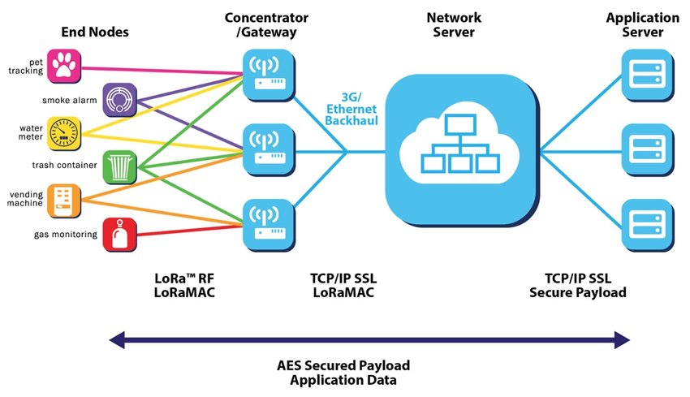
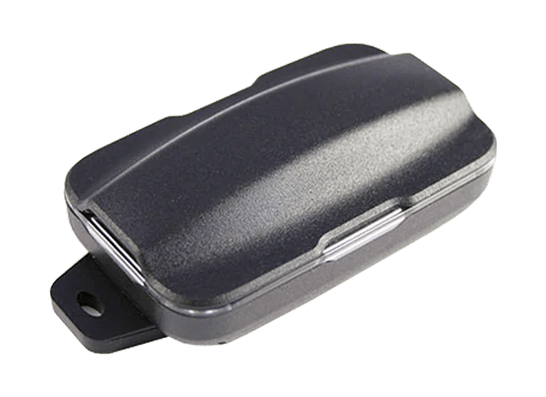
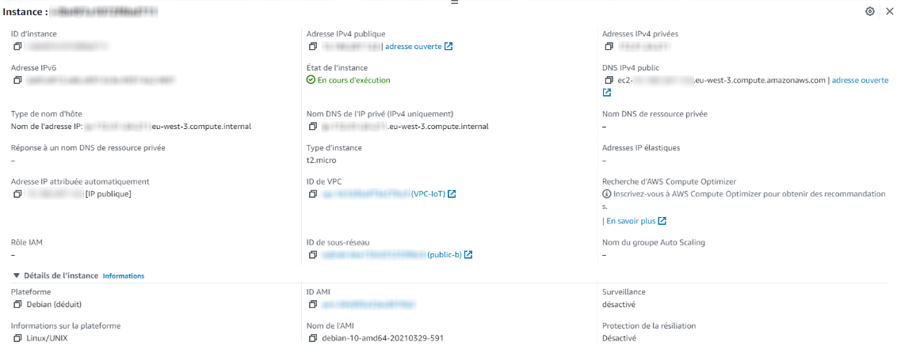
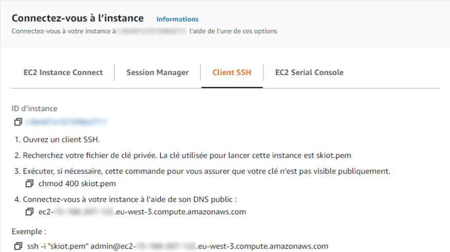
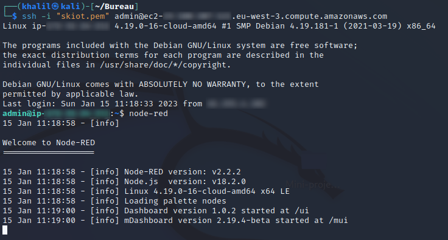
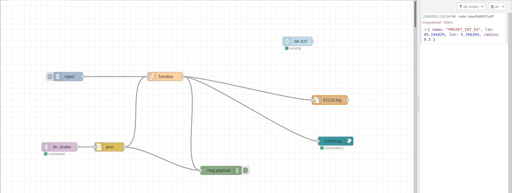
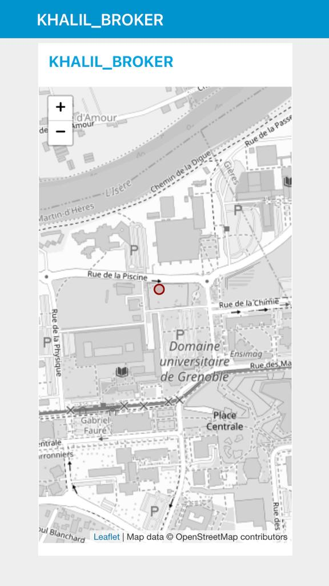

 

  

<!-- title -->

# projet-LR1110    

<!-- TABLE OF CONTENTS -->

  
Table des matières

  <ol>
    <li><a href="#Analyse du marché des produits commerciaux concurrents">Analyse du marché des produits commerciaux concurrents</a></li>
    <li><a href="#Définition de l’architecture globale du systèmes (ensemble d’objets, service en ligne (cloud))">Définition de l’architecture globale du systèmes (ensemble d’objets, service en ligne (cloud))</a>
      <ul>
        <li><a href="#1er bloc: acquisition">1er bloc: acquisition</a></li>
        <li><a href="#2eme bloc: connectivité">2eme bloc: connectivité</a></li>
        <li><a href="#3eme bloc: traitement des données">3eme bloc: traitement des données</a></li>
        <li><a href="#4eme bloc: présentation des données">4eme bloc: présentation des données</a></li>
      </ul> 
    </li>
   <li><a href="#Définition de la sécurité globale (clé de chiffrage)">Définition de la sécurité globale (clé de chiffrage</a>
      <li><a href="#Respect de la vie privée du service (RGPD)">Respect de la vie privée du service (RGPD)</a>
      <li><a href="#Estimation du coût de la BOM du produit pour 5000 unités produites et estimation de la durée de vie de la batterie de l’objet">Estimation du coût de la BOM du produit pour 5000 unités produites et estimation de la durée de vie de la batterie de l’objet</a>
       <li><a href="#Réaliser une analyse (brève) du cycle de vie du produit “durable” et “sobre” (ACV)">Réaliser une analyse (brève) du cycle de vie du produit “durable” et “sobre” (ACV)</a>
  </ol>

Notre projet porte sur l’étude d’un tracker Lora  permettant le suivi de troupeaux d’animaux (bovins...) et la détection d’anomalies tel qu’une attaque de prédateur par exemple.  L’objectif est de pouvoir récupérer les coordonnées GPS émis constamment par celui-ci et pouvoir les lire.
Dans un premier temps,  nous avons commencé par travailler avec le tracker GPS Dragino LoRaWAN LGT-92-LI, basé sur le microcontrôleur STM32L072, qui envoie des données de géolocalisation et permet d’atteindre de longues portées à de faibles débits de données en minimisant la consommation électrique. Nous utilisons la version de tracker rechargeable, avec le boîtier de protection et tracking en temps réel et nous avons également la possibilité d’utiliser le port USB.Ceci dit, l’étude du lgt92 a été relativement rapide avant que nous soyons passé au LR1110.

<!-- Analyse du marché des produits commerciaux concurrents -->
## Analyse du marché des produits commerciaux concurrents

 
Les produits de tracking LoRa concurrents au LR1110 sont nombreux et ils se distinguent par leur caractéristique qu’ils apportent. La principale fonctionnalité est bien évidemment la transmission de données de géolocalisation mais certains possèdent des fonctions annexes tel que retransmettre les données envoyées par un capteur de mouvement (capteur à 9 axes) ou encore l’émission du niveau de batterie de l’appareil afin d’en informer l’utilisateur. Selon certains modèles, de remonter beaucoup plus de données tel que la température, l’humidité, la lumière , le choc, inclinaison, Mouvement et Activité.     	
Les différents tracker concurrents se différencient aussi bien par la clientèle touchée : Entreprise de transports logistiques permettant le suivi de grosses marchandises (conteneurs)  continuellement et éviter les vols et égarement, par les engins des entreprises minières , utilisé aussi pour le suivi de animaux (incluant notre projet) aussi bien dans une ferme ou animal compagnie , d’autres sont spécialisés dans le suivi de véhicules (véhicules personnels, ou suivi de flotte de véhicules de locations).
Nous pouvons citer les trackers :  G62 ou Oyster de chez Digital matter ou les tracker d’activité personnelle (suivi de personnes âgées ou de personnes malades parkinson, Alzheimer) de chez IOT Factory. Ces trackers sont de l’ordre unitaire d’environ 100€

<!-- Définition de l’architecture globale du systèmes (ensemble d’objets, service en ligne (cloud)) -->
## Définition de l’architecture globale du systèmes (ensemble d’objets, service en ligne (cloud))

Généralement l’architecture des systèmes IOT se ressemblent se. on a souvent au début de la chaîne un device pour l’acquisition des données ( capteurs, trackers…) , et puis on trouve le bloc de connectivité qui peut différer selon l'intérêt du projet(LORA, LTE-M, NBIOT…), ensuite on trouve le bloc du traitement des données afin de les rendre  exploitable et présentable, cette partie se fait dans un serveur et généralement sur une machine virtuelle ou on peut mettre des programmes tourner derrière (python,c++,c…) ou des outils de gestion des flux comme Node-RED qu’on a adopté comme solution dans notre projet.

Finalement, on trouve le dernier bloc dans la chaîne IOT qui est la présentation des données, Ce dernier bloc peut varier entre la présentation et le stockage des données qui seront reboucler vers le bloc de traitement, encore une fois l'architecture dépend de l'intérêt du projet. 

Dans le cas de  notre projet, on essaye de remonter la donnée d’un tracker de type LR1110 fournis par semtech. Vu que le tracker fonctionne en lora, on s’attend à une architecture globale qui ressemble à la figure ci-dessous.

 

  

On fait communiquer le tracker en lora avec la gateway fournis par fablab, récupérer les donnée en temps réel depuis le serveur TTN et finalement faire une intégration MQTT qui nous permettra de récupérer les données sur notre propre serveur afin de les traiter et les présenter sur un autre endpoint ( qu’il soit un fichier .log sur notre machine virtuelle ou une application sur un téléphone).

<!-- 1er bloc: acquisition -->
### 1er bloc: acquisition:

 

  

Pour le bloc d’acquisition on a un tracker LR1110 fournis de Semtech est un module de traqueur GPS/GNSS ultra-basse consommation qui intègre un récepteur GPS/GNSS haute sensibilité, une horloge temps réel (RTC), un processeur Arm Cortex-M0+ et une mémoire flash. Il prend en charge les signaux GPS, GLONASS, BeiDou, Galileo et QZSS et peut fonctionner avec une alimentation de seulement 1.8V à 3.3V. Le module peut être utilisé dans des applications telles que les trackers de localisation pour animaux, les suiveurs de vélos et les dispositifs de suivi de personnes.

<!-- 2eme bloc: connectivité -->
### 2eme bloc: connectivité:

Pour le bloc de connectivité, Le tracker était déjà réclamée par l’utilisateur sur un serveur ttn, pour qu’on puisse l’utiliser  on a partagé les droits d'accès à ce device avec nous. Les droits partagés étaient restreints or on n'avait pas accès à tout ( partie intégration, partie de décodage encodage…). Donc, pour satisfaire cette partie de connectivité, et pouvoir récupérer les données pour pouvoir les traiter ensuite, nous avons implémenter un client MQTT sur notre propre serveur et se souscrire sur le topic de ce device qui est lui même considéré comme un client sur le broker implémenter sur le serveur TTN.

<!-- 3eme bloc: traitement des données -->
### 3eme bloc: traitement des données

Pour le bloc de traitement des données on va s'intéresser à la configuration de notre device, au format des messages uplink et downlink échangés et le filtrage des messages. Notre Devise LR1110, comme mentionné précédemment, est déjà réclamé sur TTN, donc il réussit de faire le Join et envoyer son message à base64 qui sera décodé et transformé en JSON sur le serveur TTN, notre rôle c’est récupérer ce message qui sera sous forme de buffer string, le rendre sous format JSON encore une fois, le filtrer et puis stocker les donnée dans un fichier .log ou les présenter sur une interface graphique.

  

On a pu créer notre propre serveur en créant une instance élastique sur AWS de type linux debian. Sur notre machine virtuelle implémentée dans notre serveur, on a installé les outils nécessaires pour établir une communication avec le broker tels que Node-RED, TLS…) 

 

  

 

  

 

  

Il est important de mentionner les métriques logiciels dans cette partie.
Les codes nécessaires pour réussir cette communication sont : 
-le code du encodeur/décodeur sur le serveur TTN pour transformer les messages de la base64 vers JSON.
- Le code de notre fonction sur NODE pour filtrer L’objet JSON afin d’avoir que la latitude et longitude ainsi que l’accuracy qui sera responsable de déterminer le rayon de la position du tracker.Vous pouvez trouvez les codes dans les fichiers dans le projet. Le fait de se baser sur des outils comme NODE pour gérer les flux nous permet d’utiliser moins de codes donc avoir une implémentation simple et robuste.

 

  

<!-- 4eme bloc: présentation des données -->
### 4eme bloc: présentation des données

Pour le dernier bloc on a choisi de présenter la position du tracker sur un plan en utilisant le package Worldmap et puis mettre un end point sur red-remote ce qui nous permet de visualiser la position sur votre téléphone.

 

  

<!-- Définition de la sécurité globale (clé de chiffrage) -->
## Définition de la sécurité globale (clé de chiffrage)

  Sur l’aspect matériel, le tracker LR1110 dispose d’une suite d’octets définissant le Dev EUI ET LE JoinEUI. Ces codes sont attribués à titre unique pour identifier un appareil dans un réseau Lora : le JoinEUI est utilisé pour l’inscription du tracker dans le réseau et le DevEUI permet d’identifier de manière unique le tracker dans le réseau Lora.

On l’utilise pour établir une communication sécurisée. Le tracker est basé sur un algorithme de chiffrement par blocs AES-128, les données sont traitées par blocs de 128 bits. Il permet de sécuriser les données de localisations et les communications établies. Il prend en charge l’authentification entre appareils à l’aide de clés partagés (via protocole LoraWAN) et permet la confidentialité des informations pour empêcher les accès non autorisés.
 
#### -Sur l’aspect logiciel :
 
La sécurité des gateways Lora repose sur deux protocoles de sécurité : AES-128 et OTAA, permettant de chiffrer les données les données transmises et de gérer la configuration des appareils connectés.
TTN (The Things Networks) est un réseau d’IOT qui utilise aussi le protocole de sécurité AES-128 qui va protéger en chiffrant les données transmises. Le protocole de communication IOT utilisé est : MQTT (Message Queue Telemetry Transport) et permet aux devices IoT (le tracker) de se connecter, dans la finalité, au serveur aws et recevoir les données de géolocalisation. Nous utilisons le protocole de chiffrement TLS pour chiffrer les données transmises

